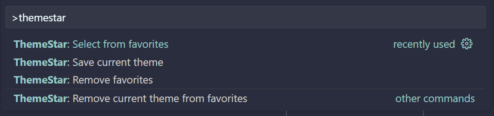

# ThemeStar

A simple VS Code extension to save your favorite themes and quickly switch
between them.

Maybe you've got lots of themes installed like me, and switch between them
often. Light and dark modes or specific themes for specific languages. Keep a
shortlist to switch more easily.

## Features

Adds the following commands to the Command Palette:

- ThemeStar: Save current theme
- ThemeStar: Select from favorites
- ThemeStar: Remove current theme from favorites
- ThemeStar: Remove favorites

## License

MIT, (c) 2023 Pixelcop Research, Inc.

[ThemeStar logo](./docs/themestar.png) created by [Freepik - Flaticon](https://www.flaticon.com/free-icons/coding "coding icons").
